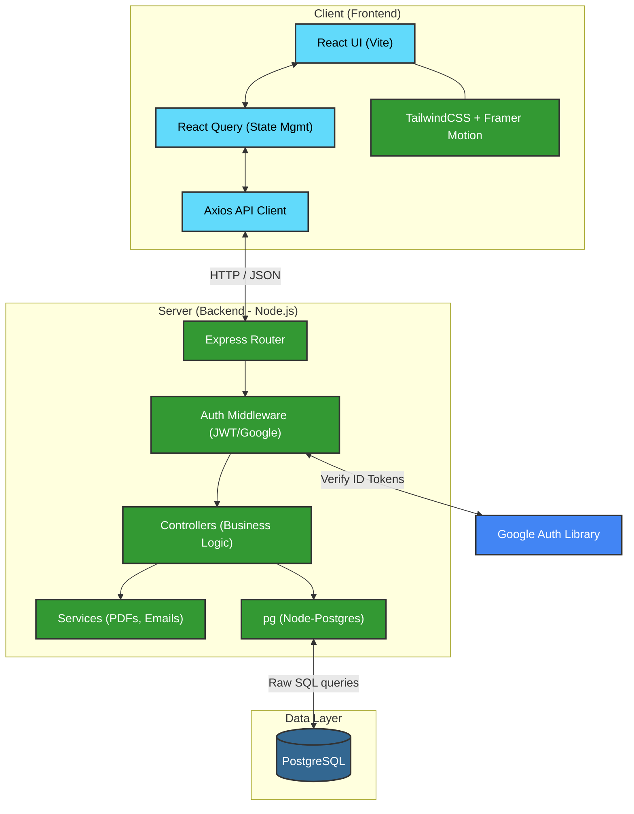

# Volunteer Management System Architecture

Below is a detailed overview of the technologies and architecture that power this application.

## Architecture Diagram

Here is a technical diagram illustrating how data flows between the user and the database.

---

## 1. Frontend Layer

The application interface is a **Single Page Application (SPA)** built to be blazing fast and highly interactive.

- **Framework:** React.js bootstrapped with **Vite** for instantaneous hot-module replacement and rapid builds.
- **State Management:** **TanStack React Query** is heavily used for server-state management. It handles caching, background data fetching, and loading states so the UI stays snappy.
- **Styling:** **Tailwind CSS** provides utility-first styling for a completely custom and responsive design. Animations are powered by **Framer Motion**.
- **Data Fetching:** **Axios** intercepts requests to append authentication headers and handles API responses.

## 2. Backend Layer

The backend is a robust RESTful API that handles business logic, authorization, and data processing.

- **Server Environment:** Built on **Node.js** using the **Express.js** framework.
- **Architecture Pattern:** Uses an MVC-like structure separated into Routes, Middlewares, Controllers, and Services.
- **Security:** Incoming requests are strictly validated using `express-validator` and Zod. Endpoints are secured via role-based access control (RBAC) middleware using JSON Web Tokens (JWT).
- **Integrations:**
  - `pdfkit` dynamically generates downloadable certificates.
  - `google-auth-library` validates external SSO tokens.
  - `multer` streams and manages file uploads directly to the server.

## 3. Database Layer

Instead of relying on a heavy ORM that abstracts too much control, the database layer interacts directly with the database engine.

- **Engine:** **PostgreSQL** handles complex data relationships like mapping organizations to opportunities, events, and volunteer attendance.
- **Driver:** Uses `node-postgres` (`pg`) to execute highly optimized raw SQL queries. This removes ORM overhead and provides absolute control over performance and data structure.
